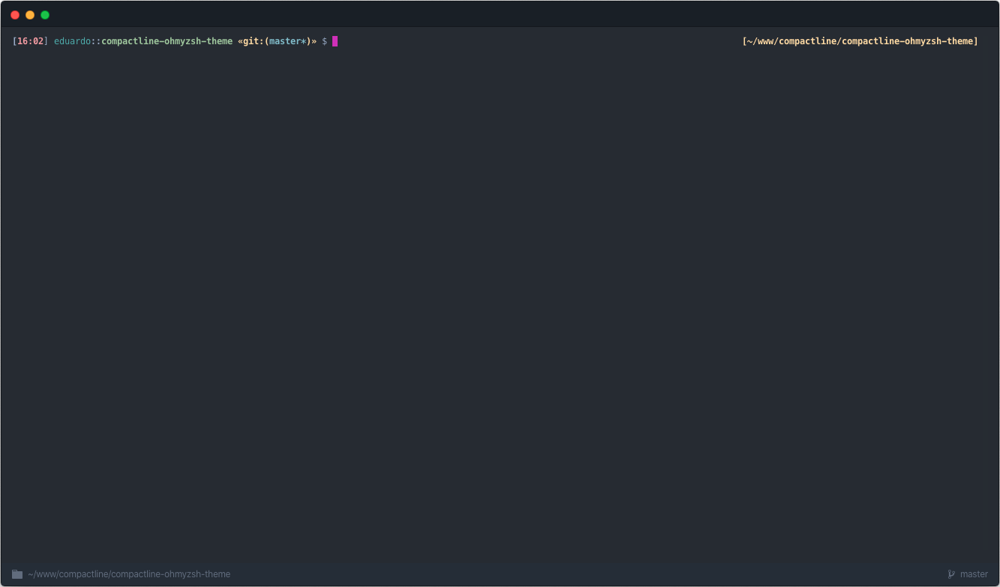

# compactline
oh-my-zsh theme.

## Preview


## Installation

1. Install first [oh-my-zsh](https://github.com/robbyrussell/oh-my-zsh)
2. Download the theme
3. Put the file **compactline.zsh-theme** in **$ZSH_CUSTOM/themes/**
4. Add or change the following line in your **~/.zshrc** file:

```bash
ZSH_THEME="compactline"
```